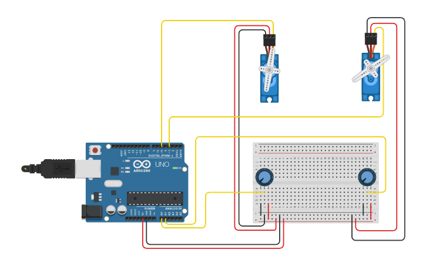

# Controle de 2 Servo Motores com Potenciômetros

Este é um projeto de simulação de circuito que demonstra como controlar dois (2) servo motores de forma independente, utilizando dois (2) potenciômetros como entrada de controle analógico.

O projeto foi inteiramente desenvolvido e simulado na plataforma **Tinkercad Circuits**.

## 🚀 Simulação ao Vivo (Tinkercad)

Você pode acessar, simular e interagir com o circuito diretamente no Tinkercad através do link abaixo:

**[Clique aqui para acessar o projeto no Tinkercad](https://www.tinkercad.com/things/7C6BlKHGE99-circuito-com-controle-de-2-servos)**

## C

Aqui está o esquema de ligação do circuito:

## 💻 Código-Fonte

O código de controle do Arduino (em C/C++) está disponível neste repositório:

**[codigo.ino](codigo.ino)**

## 💡 Tecnologias Utilizadas

* Plataforma de simulação Tinkercad
* Placa Arduino UNO R3
* Programação em C/C++
* Servo Motores
* Potenciômetros
